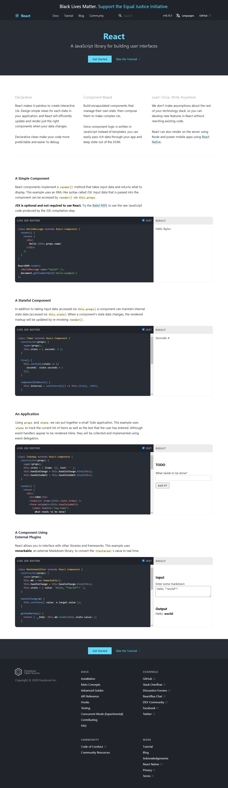

# Playwright sreenshot as service (Beta)
A simple web service that takes screenshot of the given URL.


### API
URL parameters:
- url: The URL of the website to screenshot
- width: The viewport width (in pixels), defaults to document.documentElement.offsetWidth
- height: The viewport height (in pixels), defaults to document.documentElement.offsetHeight

Example: ?url=https://reactjs.org&width=1280&height=800



### Running the server locally
```npm run start```
Open in your browser at http://localhost:3131/?url=https://reactjs.org
