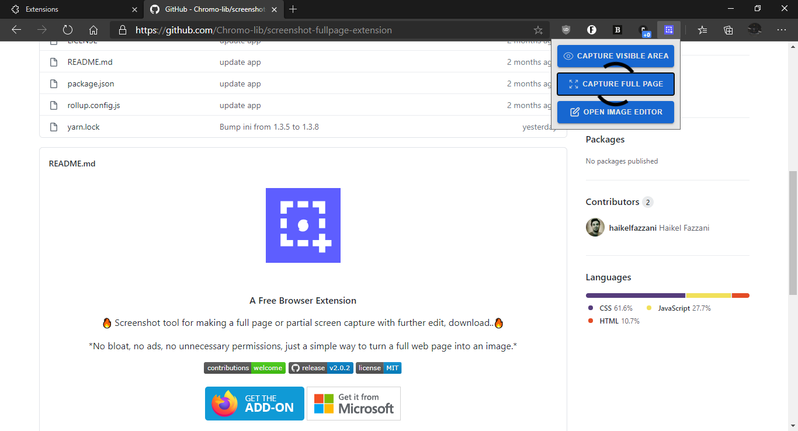

    

  <h4 style="margin-top:0">A Free Browser Extension</h4>
  
🔥 Screenshot tool for making a full page or partial screen capture with further edit, download..🔥

  
*No bloat, no ads, no unnecessary permissions, just a simple way to turn a full web page into an image.*

    

  

  
    

## Notes
- Built with [DevTools Protocol](https://chromedevtools.github.io/devtools-protocol/)
